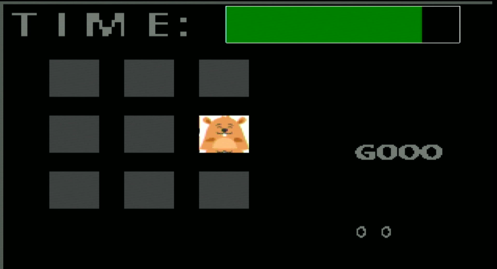

# 工程环境

+ FPGA开发板 ：TangNano-4k
+ 屏幕：HDMI接口
+ 蓝牙：JDY-33 波特率9600

# 下载现象

- 通过串口输入字符A~F，视作一次按键（图中使用了蓝牙转串口，实际可直接用串口助手调试，键值见代码。

1、按下任意键开始（若选择键值余数0123可调节难度）

2、在规定时间内尽可能输入地鼠的键值，分数+1

3、按错or时间截止，游戏结束，可通过板载按键复位

